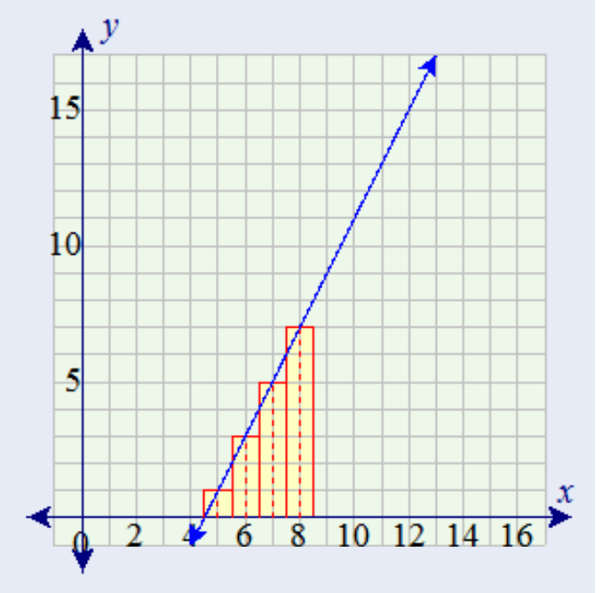

```{r setup, include=FALSE}
knitr::opts_chunk$set(echo = TRUE)
```

Problem 3 from the homework is a nice example of where many first time calculus students get tripped up. This kind of problem also likes to show up on the multiple choice section of AP tests or other standardized tests. For this week's post - who can give the best, _simplest_, answer to the following misunderstanding. 

The statement for problem is below for you reference. 

## Problem 3

**Find the total area of the red rectangles in the figure below, where the equation of the line is f ( x ) = 2x - 9**



\pagebreak
Many students see this problem and say, "The area under the curve is that of a triangle, so $\frac{1}{2}bh$ with base 4 and height 7". The 4 and 7 come right from reading the graph with the red outlined colors. But if you do that, you get and area of 14, not 16 that comes from the integral. So why does this happen???